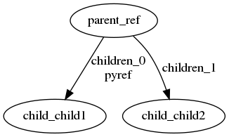

## What

This draws a nodes-and-edges diagram of the relationships between a set of
object instances in a python program, to help you check whether your test setup
code is correct.



It uses `dot` from Graphviz to render the diagram to SVG, and `display` from
ImageMagick to display it.

Here is the code to generate the diagram above:

```
    class Parent:
        def __init__(self, reference, children, pyref=None, matching=None, matching2=None):
            self.reference = reference
            self.children = children
            self.pyref = pyref
            self.matching = matching
            self.matching2 = matching2


    class Child:
        def __init__(self, id, matching=None):
            self.id = id
            self.matching = matching

    child1 = Child("child1")
    child2 = Child("child2")
    parent = Parent("ref", [child1, child2], pyref=child1)

    import fixturegraph
    entities = [parent, child1, child2]
    config = fixturegraph.Configuration(
        id_attrs={
            Parent: "reference",
            Child: "id",
        },
        attrs_with_child_refs={
            Parent: ["children", "pyref"],
        },
    )
    fixturegraph.show_diagram(config, entities)
```

## Why

The intended use case is for testing your understanding of test fixtures you've
made when writing test cases.  In other words, it's for testing your
understanding of your test setup code.  Typically, in Domain Driven Design (DDD)
terminology, the objects involved are "entities".  Entities are just objects
with an identity -- usually the identity is a string.  fixture-graph labels the
nodes in the diagram with a name formed from the type of the object and its
identity -- e.g. "Widget_1".  If the objects you're interested in aren't really
entities, you can still include them in the diagram as long as you nominate some
attribute to use as the identity to use in the label.

Sometimes you think you've set up one situation in a test when you've actually
set up a different one: I thought I had this `Widget` hooked up to these two
`Lozenge`s, but actually one of the `Lozenge`s is sitting there on its own not
connected to anything.  That often causes a false positive test result (test
passes when it shouldn't), or a false negative (test fails when it shouldn't).
I've found it can sometimes take me a long time to figure out what I did wrong,
or worse maybe I never even notice -- and then I've tested something different
to what I thought I had.

I hope that looking at these diagrams saves time and frustration when trying to
understand test setup code, and perhaps even helps avoid bugs in production
code.

I use this together with just pretty-printing all my entities from a test.  The
goal is to provide a way to sometimes tell more quickly that something is wrong,
without providing quite as much information as a full dump of the object graph
with all its python references and implicit string identifier relationships (see
next section).  It's not intended to show you everything in full detail.

## Inferring arrows

One common way to write the wrong test in this way is to fail to hook up two
objects that are related only by string identifiers (or tuples of strings /
lists of strings).  This indirect relationship is common in code that uses
Domain Driven Design patterns, where entities from different aggregates may be
related in this way rather than with explicit python references from one object
to another.  I make these same mistakes with my test setup code whether I'm
writing code this way or not, but not having an explicit relationship makes it a
bit harder for a tool like this: what arrows to draw?

This code supports that (as well as explicit python object references) by
drawing an arrow between two object instances when they have attributes with the
same string value.

If two objects have attributes that are tuples or lists of strings, the string
items in those sequences count simply as more attributes: the whole tuple need
not match another tuple for an arrow to be drawn, rather it's enough for any one
item to match.  If a sequence attribute is named `foo`, the items in the
sequence are named `foo_0`, `foo_1`, etc. in the diagram.

## Combining arrows

To make the diagram less busy, the arrows taken from your objects' attributes
are combined into fewer arrows actually drawn in the dot diagram.  Currently,
these are the rules used to do that:

1. If there are inferred arrows sharing the same value, they are combined into
   one arrow, which is labelled with the names of all the attributes involved
   (if more than one attribute has the same name, that name is only listed
   once).

2. Combine remaining arrows that share a directed edge.  Example: if Laptop1
   has attributes disk and storage both pointing to Disk1, they will be
   combined into a single arrow labelled with both attribute names.

## Installing

To use this you need Graphviz (the `dot` program in particular) and ImageMagick
(the `display` program in particular).

To install fixture-graph:

    pip install git+https://github.com/jlee1-made/pytest-icdiff.git@master#egg=pytest-icdiff

## How to use it

Here's a simple running example:

    import typing
    class SaleOrder(typing.NamedTuple):
        reference: str
        sku: str
    class Product(typing.NamedTuple):
        sku: str
    entities = [SaleOrder(reference="123", sku="abc"), Product(sku="abc")]
    config = fixturegraph.Configuration(
        id_attrs={
            SaleOrder: "reference",
            Product: "sku",
        },
    )
    fixturegraph.show_diagram(config, entities)

Here's an example showing how to use it in the form of a pytest fixture together
with some common patterns used in DDD projects (Repository, Unit of Work):

    @pytest.fixture
    def dot(unit_of_work):
        def dot():
            print()

            entities = []
            for repository_name in [
                "sale_orders",
                "products",
                "stock",
            ]:
                repo = getattr(unit_of_work, repository_name)
                entities.extend(repo.all())
            for entity in entities:
                if isinstance(entity, SaleOrder):
                    entities.extend([l for l in entity.lines])

            config = fixturegraph.Configuration(
                id_attrs={
                    SaleOrder: "get_aggregate_id",
                    SaleOrderLine: "reference",
                    Product: "aggregate_id",
                    Stock: "get_aggregate_id",
                },
                # The following are optional, only id_attrs is required:
                synonymous_attrs={
                    Stock: ["reference", "warehouse_code", "warehouse"],
                },
                attrs_with_child_refs={
                    SaleOrder: ["lines"],
                }
            )
            fixturegraph.show_diagram(config, entities)

        return dot


and then in a test:

    def test_something(dot):
        so = make_sale_order_with_two_lines()
        dot()


Note that the values of the attributes named by `id_attrs` can be either strings
or no-arguments getter methods that return a string.

You can pass optional config in `synonymous_attrs` and `attrs_with_child_refs`
to Configuration if you like.  `synonymous_attrs` will hide all but one of the
arrow labels for multiple attributes are present that are really just the same
thing under different names.  `attrs_with_child_refs` will draw arrows for
attributes you list there that are explicit python references (or lists/tuples
of explicit python references).  Both are dicts like `id_attrs` that map classes
to attribute names.

## Never-asked questions

Q. You're doing it all wrong, you should use public interfaces to construct your
   test fixtures and then they'll always be correct

A. I tend to agree with this advice, but it's still possible to end up with a
   scenario that's not what you intended.

## Running tests / running mypy

To run mypy, in the top level directory of the git project, run:

    ./run_mypy.sh

To run the tests, in the top level directory of the git project, run:

    ./run_tests.sh

## To do

I may well never do any of this but:

- Make the rules used to combine arrows controllable from command line.
  Possibly by entity type as well as just for all arrows?

- The graphs get complicated quickly as the number of nodes rises.  Provide
  better ways to simplify / focus on particular areas.  Of course you can
  already do that yourself by just not passing every entity in your test to
  show_diagram.

- Allow configuring how to deal with private attributes

- Allow overriding tool used to display the diagram, and what format to render
  it in (SVG, PNG, etc.)

- Provide a way to automatically discover what attributes have direct python
  references to other entities in the list passed to fixturegraph.show_diagram,
  instead of having to list the names of those attributes in
  `Configuration.attrs_with_child_refs`
